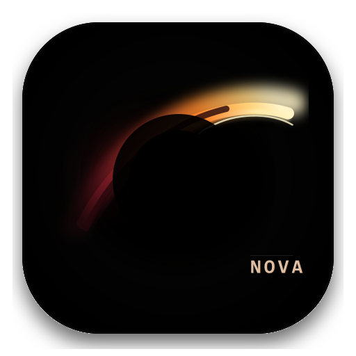

<p align="center">
  
</p>

<h1 align="center">Nova Agent</h1>

<p align="center">
  <strong>说出来，剩下交给它。</strong>
</p>

<p align="center">
  适合新手、懒人、业余开发者使用的本地桌面 Agent · 长会话不丢上下文 · 一句话跑完全流程
</p>

<p align="center">
  <a href="./LICENSE"></a>
  
  
  
  
</p>

<p align="center">
  <a href="#它能帮你做什么">它能做什么</a> •
  <a href="#和别人有啥不一样">核心差异</a> •
  <a href="#3-分钟上手">快速上手</a> •
  <a href="#现成能用的小帮手">内置技能</a> •
  <a href="#常见问题">FAQ</a>
</p>

---

## 一句话介绍

想做个小工具？想让 AI 帮你改个 bug？想从零搭个项目？

别再一步步敲命令了。打开 Nova Agent，**像跟朋友聊天一样说一句话**——

> "帮我做一个待办事项 app"
> "修一下登录页那个 bug"
> "给这个项目加个深色模式"

它会自己想清楚要做什么、自己动手做、自己检查一遍、最后把结果交给你。

**你不是 prompt 工程师，也不是全栈开发者，你只是有个想法的人。** Nova Agent 帮你把想法变成能用的东西。

> 适合：新手、业余开发者、想偷懒的打工人。

---

## 它能帮你做什么

### 一次说完整件事
别人家的 AI 助手让你一步步来——`/plan` 看规划，`/run` 跑任务，`/test` 跑测试……学起来累不累？

**Nova Agent 不这样。** 你就一句话：`/br-full-dev 帮我做一个番茄钟 app`。
剩下的流程它自动跑：先想清楚 → 拆任务 → 一个个实现 → 自己测一遍 → 给你汇报。

半路崩了？没关系。**接着来，已经做完的不会重做。**

### 聊久了也不会失忆、不会爆金币
AI 助手最烦人的两个毛病：聊着聊着忘了前面说过什么、账单越烧越离谱。
Nova Agent 专门把这两件事做扎实了——长会话不丢上下文，成本也压得住。**跑几个小时的活儿，账单不会爆。**

### 聊错了可以反悔
AI 给的回答不满意？想换个方向试试？
**直接分叉。** 在某条消息那里开个新分支，让它重新来——之前的工作不丢，只是被你"存档"了，可以随时切回去。

### 它记得你的项目
今天聊过的项目背景、文件结构、你的偏好——**它会记着**。
下次开新会话，不用重新介绍一遍"我这个项目是做啥的"。

### 你说什么它都会干
读文件、改文件、跑命令、搜代码、装依赖、查文档……常用的事 Nova Agent 都会干。
高危操作（删文件、跑危险命令）会有确认弹窗，**不会偷偷搞坏你的项目**。

---

## 和别人有啥不一样

| 你用别人家... | 用 Nova Agent... |
|--------------|------------------|
| 一步步 `/plan` `/run` `/test` | 一句话 `/br-full-dev`，全自动 |
| 长会话账单爆炸 | 专门做了缓存治理，成本压得住 |
| 聊错方向就完蛋 | 随时分叉，反悔不丢工作 |
| 换项目要重新介绍背景 | 项目记忆自动续上 |
| 只有 IDE 插件 | 完整桌面 app，独立的 |
| 跟着别人用哪个模型 | 想用啥用啥，自带 Key 接任意兼容服务 |

---

## 3 分钟上手

需要装 [Node.js 18+](https://nodejs.org/)。准备好你的 API Key（MiniMax / GLM / DeepSeek / Ollama / 自建都行）。

```bash
git clone <repository-url>
cd nova-agent
npm install
npm run dev
```

启动后：

1. 填 API Key（左下角 **设置 → LLM 配置**）
2. 选个模型
3. 选个项目文件夹

然后——**在对话框里直接说你想做什么**。

第一次不知道说啥？输入 `/onboard`，Nova Agent 会带你熟悉一遍。

想直接爽一把？输入 `/br-full-dev 帮我做一个待办事项 app`，看它自动跑完。

---

## 现成能用的"小帮手"

Nova Agent 装好就有这些开箱即用的技能，输入 `/` 就能用：

**通用：**

| 名称 | 干啥用 |
|------|--------|
| `/onboard` | 打开工作区后，让 AI 带你快速熟悉项目结构 |
| `/br-full-dev <需求>` | **一句话跑完整个开发流程**（核心） |
| `/skill-creator` | 想自己做技能？照着做 |
| `/skill-add` | 从网上装个新技能 |

**开发流程：**

| 名称 | 干啥用 |
|------|--------|
| `/br-debug` | 卡 bug 了？让 AI 帮你找根因 |
| `/br-test` | 帮你写测试、跑测试 |
| `/br-review` | 改完了？让 AI 审查一遍代码 |
| `/br-ship` | 要发布了？走发布流程 |
| `/br-verify` | 改完不放心？让 AI 验证一遍 |
| `/br-task-breakdown` | 任务太复杂？让 AI 拆成小步骤 |
| `/br-scope-check` | 项目范围太大？让 AI 帮你砍 |

**想法阶段：**

| 名称 | 干啥用 |
|------|--------|
| `/br-brainstorming` | 没想法？让 AI 帮你头脑风暴 |
| `/br-idea` | 想法太笼统？让 AI 帮你具象化 |
| `/br-office-hours` | 想被"产品经理"挑战一下？ |

要装新技能？把 `SKILL.md` 丢进 `~/.nova/skills/<name>/`，重启就生效。

---

## 钱怎么算

Nova Agent 本身**免费**（MIT 开源）。你只需要自己出 AI 调用的钱——也就是你 API Key 对应服务商的价格。

Nova Agent 在「长会话省钱」这件事上做了不少功夫：尽量不重复计费、自动在合适时机压缩长对话、分支探索不污染主线开销。**长跑几个小时的活，账单比一般 Agent 明显低。**

---

## 跑得动什么、跑不动什么

- **跑得动**：长任务（小时级）、多步骤、多文件改动的活儿
- **跑得动**：跑测试、装依赖、查文档、读代码、改代码
- **不擅长**：需要你实时看屏幕做判断的事
- **不擅长**：连上你的真机做部署

---

## 文件都放哪

| 用途 | 位置 |
|------|------|
| 应用配置 | `~/.nova/` |
| 你的项目 | 你选哪个文件夹都行 |
| 项目内的配置 | `<你的项目>/.nova/` |

新会话、缓存、检查点这些由应用自动管理，你不用管。

---

## 常见问题

**Q: 我不会写代码能用吗？**
A: 可以。你不用写代码，你只需要用**自然语言告诉它你想做什么**。

**Q: Windows 能装吗？**
A: 能。还可以打成一键安装包（`npm run dist` 出来就是个 `.exe`）。

**Q: 跟 Cursor / Claude Code 比呢？**
A: 那些主要在编辑器里用，前提是你得会写代码。Nova Agent 是**完整的桌面 app**，核心卖点是听你一句话就能跑完整流程，不用你懂命令。

**Q: 数据安全吗？**
A: Nova Agent 是**本地桌面 app**，对话、文件、检查点都存在你电脑上，不上传第三方。AI 调用走你自己的 API Key，流量只在你和服务商之间。

**Q: API Key 必须用自己的？**
A: 对。Nova Agent 不收 Key、不中转请求、不抽成。

**Q: 出错了怎么办？**
A: 大部分小问题它自己就处理了：网络抖了自动重试、对话太长自动压缩、主模型挂了自动切备选。

---

## 想自己改代码 / 参与开发？

Nova Agent 是 MIT 开源的，TypeScript 写的。

```bash
npm run typecheck   # 查类型
npm test            # 跑测试（1800+ 用例）
npm run validate:skills  # 校验内置技能
```

技术架构、变更记录看 [CHANGELOG.md](./CHANGELOG.md)。
开发约定、目录结构、IPC 流程看 [AGENTS.md](./AGENTS.md)。

---

## 许可证

[MIT](./LICENSE) — Copyright (c) 2026 Harrison Xu

随便用，保留版权就行。

---

## 致谢

参考了 pi-agent、opencode、kilo code、openclacky 等优秀项目。